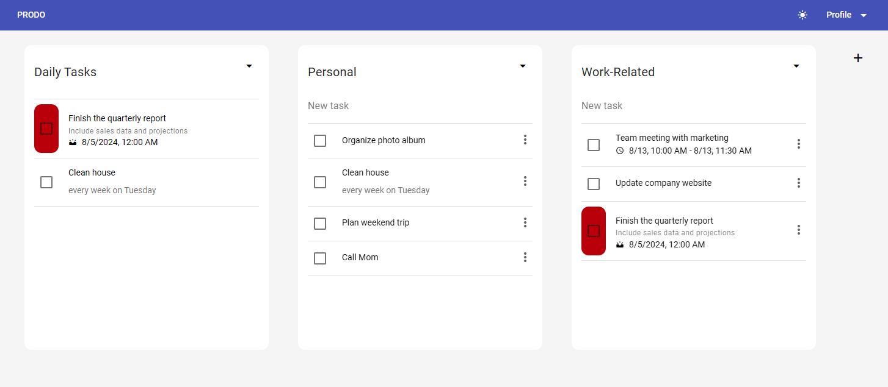

# Prodo
Simple web application for managing events and tasks 
with export to iCalendar format aiming to boost productivity.



## Features
- Create, edit and delete tasks.
- Schedule them to specific dates, make them recurring.
- Organize tasks in lists.
- Export events and tasks to iCalendar format.
- PWA support (you can add the application to your home screen on mobile devices).

Note: This application is a hobby project and may not be stable,
and may not have all the features you would expect from a task manager.

## Installation
You can run the application on bare metal or in a container.

### Bare metal
You need to have Rust and pnpm installed on your system.

Build and install application using `make`:
```bash
make && make install
```

Instalation script will create a new user and group `prodo` 
for the application, copy the binary to `/usr/bin`,
copy the frontend files to `/usr/share/webapps/prodo` and create
an OpenRC service if you are using OpenRC.

### Docker
You can directly run the application using Docker. 

```bash
docker compose up --build
```

## Configuration
You can configure the application using environment variables.
See `etc/prodo/config.ev` for available options.

When configured, you will need to create a new user using the following command:
```bash
prodo user create --username <username> --email <email>
```
You will be prompted to enter a password for the new user.

Now you can start the application using the following command:
```bash
prodo start
```
or if you are using OpenRC:
```bash
service prodo start
```

## Development
```bash
cp .env.example .env
```

```bash
# Run development database
docker-compose up -d database
```

## Licence
This project is licensed under the MPL 2.0 License - see the [LICENCE](LICENCE) file for details.

## References
- RFC 5545 - Internet Calendaring and Scheduling Core Object Specification (iCalendar) - https://tools.ietf.org/html/rfc5545
- [Material Design Icons](https://fonts.google.com/icons/)
